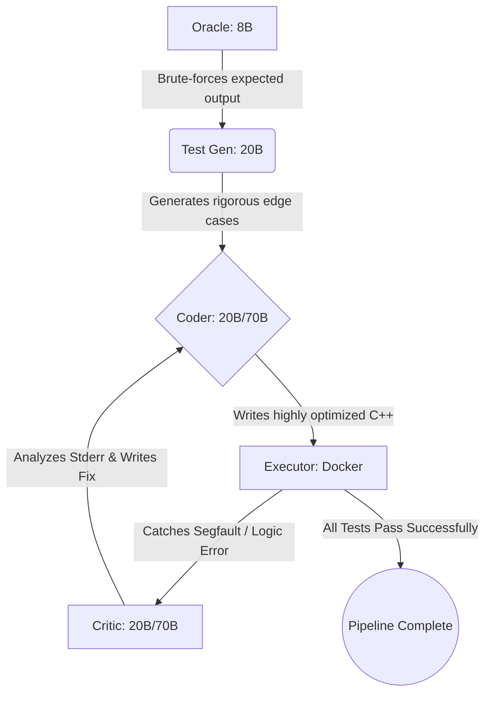

# 🚀 Agentic C++ Code Sandbox

![UI Demo][demo-img] [![Python 3.10+][python-shield]][python-url]
[![LangGraph][langgraph-shield]][langgraph-url]
[![Streamlit][streamlit-shield]][streamlit-url]
[![Docker][docker-shield]][docker-url]

An autonomous, multi-agent LLM pipeline that writes, containerizes, and tests C++ algorithmic solutions in a secure, ephemeral Docker environment.

Unlike standard LLM code generators (like ChatGPT or Copilot) that suffer from "blind" coding, this system utilizes a **Ground Truth Oracle** to prevent test hallucinations and a **Critic Reflection Loop** to automatically catch compilation errors, memory bounds faults (segfaults), and logical failures by reading raw `stderr`/`stdout` logs.

## 🧠 System Architecture

The pipeline is orchestrated using a `LangGraph` finite state machine, routing state across 5 specialized LLM agents.



### ✨ Core Features

* **Multi-Model Load Balancing:** Intelligently routes lightweight tasks (Test Generation) to 8B/20B parameter models and heavy reasoning tasks to flagship models to bypass API rate limits and optimize Tokens.
* **Ground Truth Oracle:** Prevents "Gaslighting." AI models frequently miscalculate mathematical expected outputs. The Oracle strictly writes O(N^2) brute-force Python to mathematically guarantee the grading key is 100% accurate.
* **Docker Isolation:** C++ code is mounted into an ephemeral `gcc:latest` Docker volume. This safely traps infinite loops and `Segmentation fault (core dumped)` errors without crashing the host machine.
* **Autonomous Self-Correction:** If code fails, the Critic node reads the raw C++ compiler logs and test diffs, diagnoses the flaw (e.g., memoryless sliding windows, EOF stream failures), and forces the Coder to rewrite it.

---

## 📊 Benchmark Results: The 5-Problem Gauntlet

The pipeline was rigorously tested against a custom benchmark designed to stress different C++ vulnerabilities.

| Challenge Type | Problem | Result | Critic Intervention |
| :--- | :--- | :--- | :--- |
| **Pointers** | Sliding Window | ✅ Pass | Caught memoryless window bug;<br>forced `std::vector` history. |
| **2D Matrix** | 3x3 Max-Pooling | ✅ Pass | None required (Zero-padding<br>safely dominated boundaries). |
| **Strings** | Valid Parentheses | ✅ Pass | Intercepted an EOF stream<br>crash on empty string `""`. |
| **Recursion** | Number of Islands | ✅ Pass | Avoided Stack Overflow by<br>choosing heap-allocated BFS. |
| **O(1) Data** | LRU Cache | ⚠️ Partial | Coder wrote perfect O(1) logic,<br>but I/O parsing crashed QA. |

---

## ⚙️ Local Installation & Setup

### Prerequisites
1. **Docker Desktop** (Must be running in the background)
2. **Python 3.10+**
3. **Groq API Key**

### Quick Start

**1. Clone the repository**
```bash
git clone https://github.com/yourusername/agentic-code-sandbox.git
cd agentic-code-sandbox
```

**2. Install dependencies**
```bash
python -m venv venv
source venv/bin/activate  # On Windows use `venv\Scripts\activate`
pip install -r requirements.txt
```

**3. Configure Environment Variables**
Create a `.env` file in the root directory:
```env
GROQ_API_KEY=gsk_your_api_key_here
```

**4. Launch the Streamlit UI**
```bash
streamlit run app.py
```
*Navigate to `http://localhost:8501` to use the interactive Sandbox.*

[demo-img]: demo.gif
[python-shield]: [https://img.shields.io/badge/python-3.10+-blue.svg](https://img.shields.io/badge/python-3.10+-blue.svg)
[python-url]: [https://www.python.org/downloads/](https://www.python.org/downloads/)
[langgraph-shield]: [https://img.shields.io/badge/LangGraph-Agents-orange](https://img.shields.io/badge/LangGraph-Agents-orange)
[langgraph-url]: [https://python.langchain.com/docs/langgraph](https://python.langchain.com/docs/langgraph)
[streamlit-shield]: [https://img.shields.io/badge/Streamlit-UI-FF4B4B](https://img.shields.io/badge/Streamlit-UI-FF4B4B)
[streamlit-url]: [https://streamlit.io/](https://streamlit.io/)
[docker-shield]: [https://img.shields.io/badge/Docker-Sandbox-2496ED](https://img.shields.io/badge/Docker-Sandbox-2496ED)
[docker-url]: [https://www.docker.com/](https://www.docker.com/)